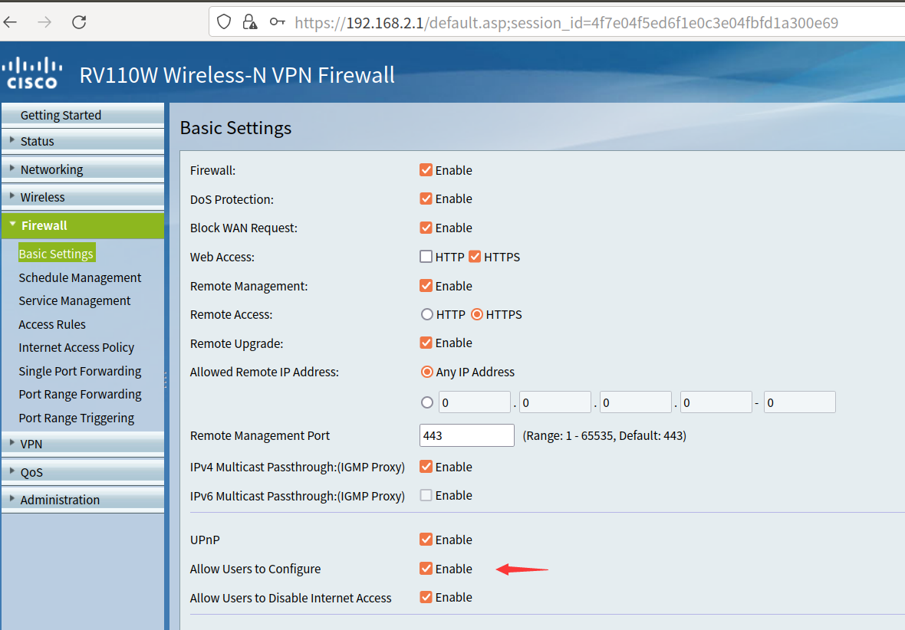
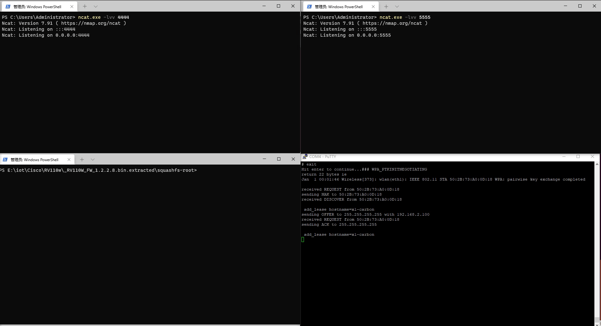

# Cisco RV110W UPnP 0day 分析

# 前言

最近UPnP比较火，恰好手里有一台Cisco RV110W，在2021年8月份思科官方公布了一个Cisco RV系列关于UPnP的0day，但是具体的细节并没有公布出来。于是想要用手中的设备调试挖掘一下这个漏洞，漏洞的公告可以在[官网](https://tools.cisco.com/security/center/content/CiscoSecurityAdvisory/cisco-sa-cisco-sb-rv-overflow-htpymMB5)看到。

# 准备工作

首先将固件更新到最新版本[1.2.2.8](https://software.cisco.com/download/home/283879340/type/282487380/release/1.2.2.8?i=!pp) ，接下来面临的一个问题就是如何调试和定位漏洞。首先解决调试的问题，调试的首要工作就是拿到设备的shell，不过最新的固件并没有提供调试的接口，笔者这里通过UART串口和修改固件包的方式拿到了最新固件的调试权限,具体的方法参考之前写过的一篇文章[路由器调试之getshell](https://badmonkey.site/archives/router-debug-getshell) 。

## 调试准备

Cisco RV110W是mipsel架构，所以需要先找一个对应的gdb-server,可以自己交叉编译也可以使用别人编译好的，这里推荐[gdb-static-cros](https://github.com/stayliv3/gdb-static-cross)s 。

## 漏洞定位

官方公告指出漏洞存在于UPnP服务中，首先进入后台管理，FireWall的Basic Settings打开UPnP的配置



然后nmap扫一下端口，并没有发现UPnP的端口，但是测试发现UPnP的确打开了。


> 这里笔者使用[UPnPy](https://upnpy.readthedocs.io/en/latest/)进行漏洞的测试和利用。
> 

```python
import socket
msg = \
    b'M-SEARCH * HTTP/1.1\r\n' \
    b'HOST:239.255.255.250:1900\r\n' \
    b'ST:upnp:rootdevice\r\n' \
    b'MX:2\r\n' \
    b'MAN:"ssdp:discover"\r\n' \
    b'\r\n'

# Set up UDP socket
s = socket.socket(socket.AF_INET, socket.SOCK_DGRAM, socket.IPPROTO_UDP)
s.bind((b"192.168.2.100",23333)) #本机IP
s.settimeout(2)
s.sendto(msg, (b'239.255.255.250', 1900))
addr = ('192.168.2.1', 1900) # 网关IP
try:
    while True:
        data, addr = s.recvfrom(65507)
        print(addr,data)

except socket.timeout:
    pass
```

发现确实得到了UPnP的响应，而且在设备的进程中存在对应的UPnP进程


### 服务分析

UPnP是一种通用的协议标准，厂商大多按照标准实现,即很多action都是一致的，但是也有必要对设备提供的服务进行分析以便于漏洞的定位和利用，同样使用UPnPy进行信息的收集

```python
import upnpy
import socket

import requests
from upnpy.ssdp.SSDPDevice import SSDPDevice
msg = \
    b'M-SEARCH * HTTP/1.1\r\n' \
    b'HOST:239.255.255.250:1900\r\n' \
    b'ST:upnp:rootdevice\r\n' \
    b'MX:2\r\n' \
    b'MAN:"ssdp:discover"\r\n' \
    b'\r\n'

# Set up UDP socket
s = socket.socket(socket.AF_INET, socket.SOCK_DGRAM, socket.IPPROTO_UDP)
s.bind((b"192.168.2.100",23333))
s.settimeout(2)
s.sendto(msg, (b'239.255.255.250', 1900))
addr = ('192.168.2.1', 1900)
data = b""
try:
    while True:
        data, addr = s.recvfrom(65507)
        print(addr,data)
except socket.timeout:
    pass

# data = b'HTTP/1.1 200 OK\r\nCache-Control: max-age=120\r\nDate: Fri, 01 Jan 2010 00:44:16 GMT\r\nExt: \r\nLocation: http://192.168.2.1:1780/InternetGatewayDevice.xml\r\nServer: POSIX UPnP/1.0 linux/5.70.48.16\r\nST: upnp:rootdevice\r\nUSN: uuid:31474a87-67ea-dae4-2f73-f157fb06d22b::upnp:rootdevice\r\n\r\n'
# data = b'HTTP/1.1 200 OK\r\nCache-Control: max-age=3600\r\nST: upnp:rootdevice\r\nUSN: uuid:824ff22b-8c7d-41c5-a131-8c3bad401726::upnp:rootdevice\r\nEXT:\r\nServer:  Unspecified, UPnP/1.0, Unspecified\r\nLocation: http://192.168.3.1:56688/rootDesc.xml\r\n\r\n'

device = SSDPDevice(addr, data.decode())
services = device.get_services()

services_id = [services[i].id.split(":")[-1] for i in range(len(services))]

for id in services_id:
    service = device[id]
    actions = service.get_actions()
    for action in actions:
        for argument in action.arguments:
            print(id,action.name,argument.name)
```

可以得到一系列的服务信息，部分信息如下

```
WANIPConn1 AddPortMapping NewRemoteHost
WANIPConn1 AddPortMapping NewExternalPort
WANIPConn1 AddPortMapping NewProtocol
WANIPConn1 AddPortMapping NewInternalPort
WANIPConn1 AddPortMapping NewInternalClient
WANIPConn1 AddPortMapping NewEnabled
WANIPConn1 AddPortMapping NewPortMappingDescription
WANIPConn1 AddPortMapping NewLeaseDuration
WANIPConn1 DeletePortMapping NewRemoteHost
WANIPConn1 DeletePortMapping NewExternalPort
WANIPConn1 DeletePortMapping NewProtocol
WANIPConn1 GetExternalIPAddress NewExternalIPAddress
```

这些服务大致可以分为get类和set类，以及少数的delete类服务。由于UPnP的主要目的之一是将内网设备暴露给公网设备，这就需要进行一定的配置(端口映射等)，既然需要配置，那么配置的参数和信息必不可缺，而这些参数其实就是set类服务中的参数。

### 服务定位

由于并不是所有服务，厂商都有实现，因此需要自己逆向一下固件。首先定位到`upnp_mainloop`


所有的处理逻辑都是在upnp_dispatch中实现的，跟进分析发现了存在ssdp和http的请求处理部分


`ssdp_process`对应寻址时M-Search的请求，`upnp_http_process` 对应http请求的处理，由于正常的服务调用都是http请求，因此判断`upnp_http_process`可能存在漏洞，服务调用示例如下图所示


在`upnp_http_process`中进一步调用了`upnp_http_fsm_emgine`


跟进分析，发现会执行off_45ab80处的几个函数


这些函数包括了初始化和解析协议头的功能，最后一个函数为`upnp_http_fsm_dispatch` ,猜测会执行对应的服务函数。


跟进`upnp_http_fsm_dispatch` ，发现确实调用了函数方法，不过是根据a1和a2执行的函数调用，无法确定具体的被调用函数，需要动态调试。


如果是正常的ssdp寻址请求那么会调用`SUB_405B34`,`description_process`  ,如果是服务相关请求，会调用`soap_process` ,在`soap_process`中根据请求头信息，调用`query_process`或者`action_process`

主要关注`action_process`,根据服务调用的请求头，猜测`action_process`中的`soap_control`对应服务调用


在soap_control中仍然需要动态调试，确定具体的函数信息。


最终经过动态调试确定`sub_414C28` 对应`AddPortMapping` action，其函数调用链为

```
sub_414c28->upnp_portmap_add->upnp_osl_nat_config->strcpy(stack overflow)
```

不过在upnp_portmap_add中检查了一下本机的wan口地址，由于笔者在测试的时候并没有配置wan口，所以直接用nvram 设置了一下wan口ip。


栈溢出的时候需要控制程序流走到红色的方块中，因为蓝色方块的函数会访问被溢出的栈导致程序在RCE之前崩掉，因此需要控制*(a2+11)的值为0，幸运的是此处的值是可控的


# 漏洞利用

由于最新固件没有telnetd，可以反弹shell然后自己上一个utelnetd，然后开启telnet



参考[反弹shell的姿势](https://brucetg.github.io/2018/05/03/%E5%A4%9A%E7%A7%8D%E5%A7%BF%E5%8A%BF%E5%8F%8D%E5%BC%B9shell/)

